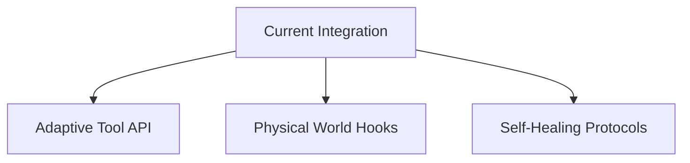

# Project Prometheus Development Guide

## Current Focus Areas (Q3 2025)

### 1. Intelligence Engine Completion (80% → 100%)
```python
# Planned enhancements:
def enhance_reasoning_engine():
    add_capability("counterfactual_analysis")
    add_capability("multi_horizon_planning") 
    optimize("context_understanding")
```

### 2. World Interaction Layer (60% → 85%)


## Implementation Process

### Weekly Development Sprints
1. **Monday**: Planning & Task Allocation
2. **Wednesday**: Mid-Sprint Review
3. **Friday**: Demo & Retrospective

### Quality Assurance
- Automated regression tests (90% coverage)
- Performance benchmarking suite
- Security validation scans

## Contribution Guidelines

### Branch Strategy
```bash
git checkout -b feature/[name]  # For new features
git checkout -b fix/[issue]     # For bug fixes
```

### Code Review Process
1. Create draft PR for early feedback
2. Request review from 2+ maintainers
3. Pass all CI checks
4. Squash merge after approval

## Monitoring Progress
```bash
# View completion metrics:
python3 -m metrics.report --component=all
```

## Getting Started
1. Set up dev environment:
```bash
./scripts/setup_dev.sh
```
2. Run test suite:
```bash
pytest tests/ --cov=src/