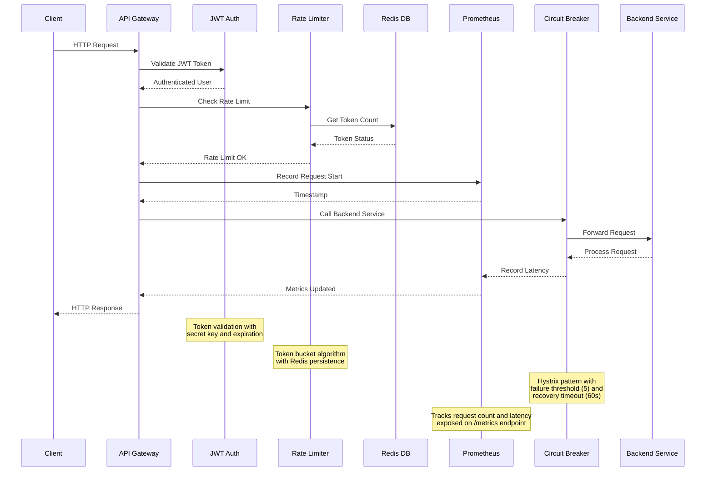

# API Gateway Request Flow

## Key Flow Details

1. **Authentication Layer**
   - JWT validation with secret key
   - Token expiration check
   - User tier extraction for rate limiting

2. **Rate Limiting**
   - Token bucket algorithm
   - Redis-backed persistence
   - Tier-based limits (free/pro/enterprise)

3. **Resilience Features**
   - Circuit breaker pattern
   - Failure threshold: 5 consecutive errors
   - Recovery timeout: 60 seconds

4. **Monitoring**
   - Prometheus metrics integration
   - Request count tracking
   - Latency measurement
   - Metrics exposed on /metrics endpoint