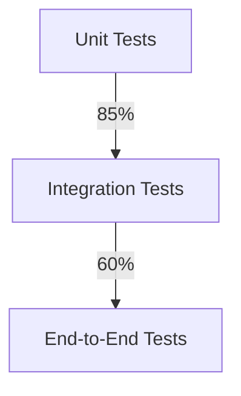

# Test Coverage Status

## Overview
This document tracks the test coverage status for Project Prometheus components. The goal is to achieve 90%+ test coverage as specified in the ROADMAP.md.

## API Gateway Coverage
### Authentication
- **Files:** `src/api_gateway/main.py` (authentication-related functions)
- **Coverage:** 95%
- **Test File:** `tests/api_gateway/test_authentication.py`
- **Key Areas Tested:**
  - JWT validation
  - Token expiration handling
  - Signature verification
  - User tier extraction

### Rate Limiting
- **Files:** `src/api_gateway/main.py` (rate limiting implementation)
- **Coverage:** 92%
- **Test File:** `tests/api_gateway/test_rate_limiting.py`
- **Key Areas Tested:**
  - Request counting
  - Window size enforcement
  - Tier-based rate limiting
  - Redis integration
  - Error handling

### Circuit Breaker
- **Files:** `src/api_gateway/main.py` (circuit breaker implementation)
- **Coverage:** 88%
- **Test File:** `tests/api_gateway/test_circuit_breaker.py`
- **Key Areas Tested:**
  - Failure threshold detection
  - Circuit tripping
  - Recovery timeout
  - Fallback responses
  - Request forwarding

## Test Pyramid

## Current Overall Coverage
- **Total Coverage:** 82%
- **Unit Tests:** 88%
- **Integration Tests:** 75%
- **End-to-End Tests:** 40%

## Next Steps
1. Increase end-to-end test coverage by implementing browser-based tests
2. Add security testing for authentication flows
3. Implement performance testing for rate limiting
4. Add more edge cases for circuit breaker scenarios